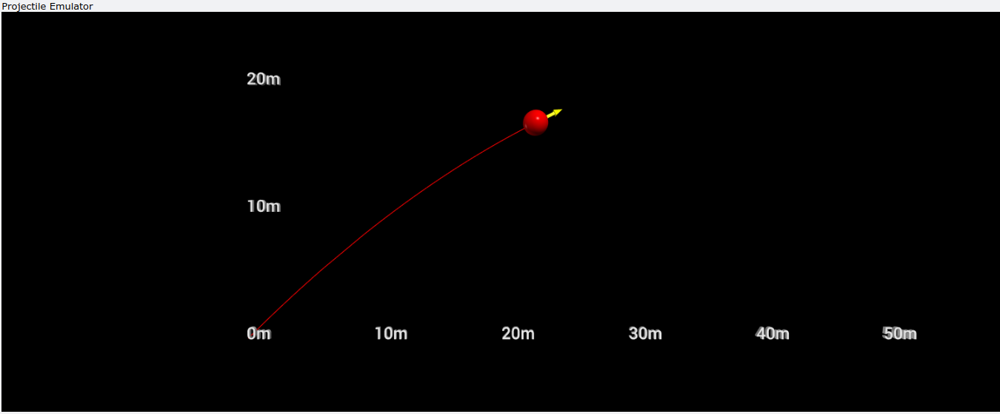
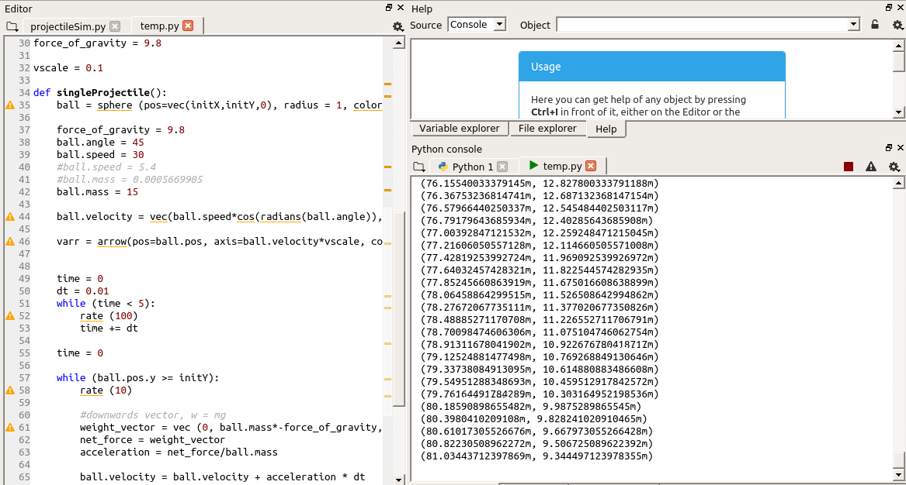

# PythonProjectileEmulator
Projectile emulator, used for SPH4U7 culminating lab report. My lab report (which can be found here in latex: https://www.overleaf.com/read/pswhydqwrtkc) studied the relationship between the angle of attack and distance travelled by a projectile. In order compare my experimental results to a theoretical value, I decided to code a simulation of a projectile launching using Python. 

I found this project especially enjoyable as it is the first time I have ever played around with scientific computing and Anaconda using python!

The following are some pictures of the program runnning:

